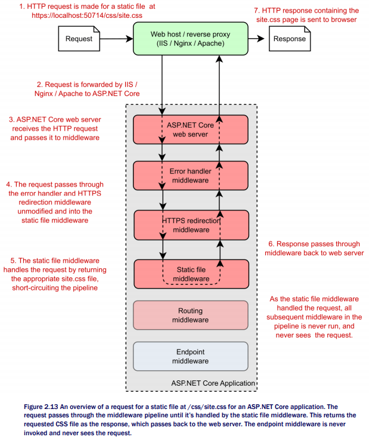
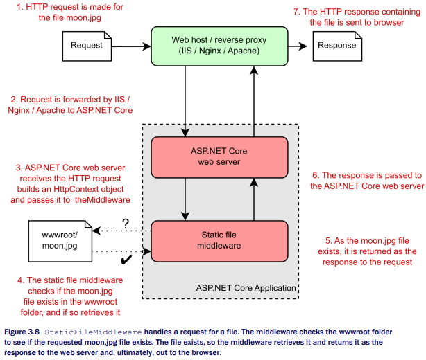
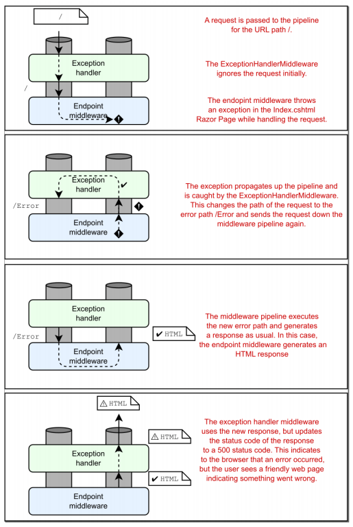

Chapter 3-Handling Requests with the Middleware Pipeline
==============================

In ASP.NET Core, middleware are C# classes that can handle an HTTP request or response. Middleware can:

<ul>
  <li>Handle an incoming HTTP request by generating an HTTP response</li>
  <li>Process an incoming HTTP request, modify it, and pass it on to another piece of middleware</li>
  <li>Process an outgoing HTTP response, modify it, and pass it on to either another piece of middleware, or the ASP.NET Core web server</li>
</ul> 



Note that is the ASP.NET core Web server (Kestrel web server) that construct a `HttpContext` object and pass this object to underlying middleware.

```C#
public abstract class HttpContext {
   protected HttpContext();
   
   public abstract HttpRequest Request { get; }
   public abstract HttpResponse Response { get; }
   public abstract ClaimsPrincipal User { get; set; }
   ...
   // Gets or sets a key/value collection that can be used to share data within the scope of this request.
   public abstract IDictionary<object, object> Items { get; set; } 

   public abstract void Abort();
}

public abstract class HttpRequest {
   protected HttpRequest();
   public abstract Stream Body { get; set; }
   public abstract string ContentType { get; set; }
   public abstract IRequestCookieCollection Cookies { get; set; }
   public abstract IHeaderDictionary Headers { get; }
   public abstract QueryString QueryString { get; set; }
   public virtual RouteValueDictionary RouteValues { get; set; }
   public abstract string Method { get; set; }   // e.g "GET" 
   ...
}
```

For example, a static file middleware works as:



If the file doesn't exist, then the request effectively passes through the static file middleware unchanged. But wait, you only added one piece of middleware, how you can pass the request through to the next middleware if there isn't another one? 

ASP.NET Core automatically adds an "dummy" piece of middleware to the end of pipeline. This middleware always returns a 404 response if it's called.

<div class="alert alert-info p-1" role="alert">
    Remember, if no middleware generates a response for a request, the pipeline will automatically return a simple 404 error response to the browser.
</div>

## Handling Errors using Middleware

When an execption ( e.g. `NullReferenceException`) thrown in a middleware, it propagates up the pipeline (the `next` delegate won't be called, so the lower middleware won't see the request represented as a `Task` with `Faulted` status). If the pipeline doesn't handle the exception, the web server
will return a 500 status code back to the user.

-To be confirmed: I think the asp.net core framework will check each middleware and when the representing Task's status is Faulted, the framework will write 500 status to the response

## Viewing Exceptions in Development with DeveloperExceptionPage Middleware

`app.UseDeveloperExceptionPage();`


## Handling Exceptions in Production: ExceptionHandlerMiddleware

The developer exception page is handy when developing your applications, but you shouldn't use it in production as it can leak information about your app to potential attackers. 

If you were to peek at the Configure method of almost any ASP.NET Core application, you'd almost certainly find the developer exception page used in combination with ExceptionHandlerMiddleware, in a similar manner to :
```C#
public void Configure(IApplicationBuilder app, IWebHostEnvironment env) {
   if (env.IsDevelopment()) {
      app.UseDeveloperExceptionPage();
   } else {
      app.UseExceptionHandler("/Error");
   }
   ...
}
```
When adding ExceptionHandlerMiddleware to your application, you'll typically provide a path to the custom error page that will be displayed to the user. In the example listing, you used an error handling path of "/Error", the process is:



You can see that the Exception middleware re-execute the request and change the the request's internal path to "/Error", so the request is passed like a new request to Endpoint middleware again.
```C#
public class ExceptionHandlerMiddleware {
   private readonly RequestDelegate _next;
   private readonly ExceptionHandlerOptions _options;
   ...

   public ExceptionHandlerMiddleware(...) {
      // assignments
      ...
      _options.ExceptionHandler = _next;
   }

   public Task Invoke(HttpContext context) {
      ...
      try {
         var task = _next(context)
         if (!task.IsCompletedSuccessfully) {
            return Awaited(this, context, task);   // eventually call _options.ExceptionHandler(context);
                                                   // that's how it re-execute the request
         }
      }
      ...
   }
}
```


<!-- <code>&lt;T&gt;<code> -->

<!-- <div class="alert alert-info p-1" role="alert">
    
</div> -->

<!-- <div class="alert alert-info pt-2 pb-0" role="alert">
    <ul class="pl-1">
      <li></li>
      <li></li>
    </ul>  
</div> -->

<!-- <ul>
  <li></li>
  <li></li>
  <li></li>
  <li></li>
</ul>  -->

<!-- <ul>
  <li><b></b></li>
  <li><b></b></li>
  <li><b></b></li>
  <li><b></b></li>
</ul>  -->

<!--  -->

<!-- <span style="color:red">hurt</span> -->

<style type="text/css">
.markdown-body {
  max-width: 1800px;
  margin-left: auto;
  margin-right: auto;
}
</style>

<link rel="stylesheet" href="./zCSS/bootstrap.min.css">
<script src="./zCSS/jquery-3.3.1.slim.min.js"></script>
<script src="./zCSS/popper.min.js"></script>
<script src="./zCSS/bootstrap.min.js"></script>