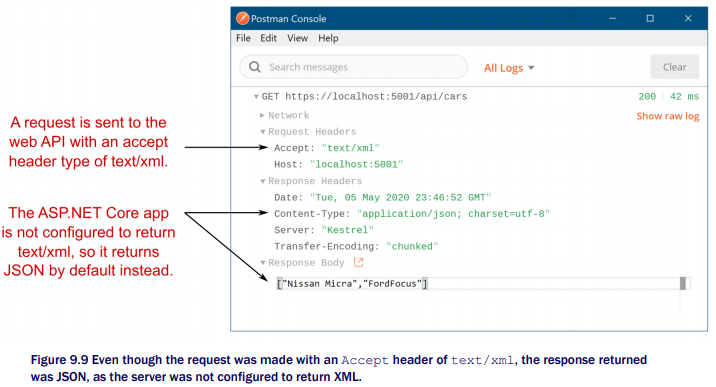
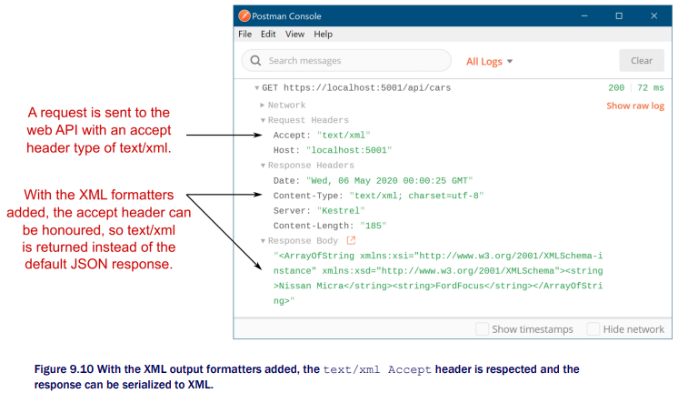

Chapter 9-Creating a Web API
==============================
```C#
// setup
public void ConfigureServices(IServiceCollection services)
{
   services.AddControllers();
} 

public void Configure(IApplicationBuilder app, IWebHostEnvironment env) {
   app.UseRouting();
   ...
   app.UseEndpoints(endpoints => {
      endpoints.MapControllers();
   });
}
```
-The difference between `public class XXXController : Controller` (default when create from VS Web API) and `public class XXXController : ControllerBase`, is that the former supports View (MVC), the latter you can return raw objects. e.g.
```C#
[ApiController]
public class FruitController : Controller
{
   public IActionResult Index() {
      return View();
   }
}

[ApiController]
public class FruitController : ControllerBase
{
   List<string> _fruit = new List<string> { "Pear", "Lemon", "Peach" };

   [HttpGet("fruit")]
   public IEnumerable<string> Index() {
      return _fruit;
   }

   [HttpGet("fruit/{id}")]
   public ActionResult<string> View(int id) {
      if (id >= 0 && id < _fruit.Count)
         return _fruit[id];
      return NotFound();   
      // note that NotFound() helper method return a NotFoundResult which inherits StatusCodeResult which inherit from ActionResult in 
      // turn, the code still compile becuase the implicit conversion
   }
}
```
Note that The use of the `FromBody` attribute to select data from the request body and explicitly checking the `ModelState.IsValid` property is not required in controllers that have been decorated with the ApiController attribute because getting data from the body and validating data are required so commonly in web services that they are applied automatically when this attribute is used, so
```C#
// without [ApiController] 
public class FruitController : ControllerBase {
   List<string> _fruit = new List<string> {
      "Pear", "Lemon", "Peach"
   }

   [HttpPost("fruit")]
   public ActionResult Update([FromBody] UpdateModel model) {
      if (!ModelState.IsValid) {
         return BadRequest(new ValidationProblemDetails(ModelState));
      }

      if (model.Id < 0 || model.Id > _fruit.Count) {
         return NotFound(new ProblemDetails() {
            Status = 404,
            Title = "Not Found",
            Type = "https://tools.ietf.org/html/rfc7231" + "#section-6.5.4" 
         });
      }

      _fruit[model.Id] = model.Name;
      return Ok();
   }
}
```
`[ApiController]` makes the above code simplified to:
```C#
[ApiController] 
public class FruitController : ControllerBase {
   List<string> _fruit = new List<string> {
      "Pear", "Lemon", "Peach"
   }

   [HttpPost("fruit")]
   public ActionResult Update(UpdateModel model) {   // The [FromBody] attribute is assumed for complex action parameter arguments     
      /*
         The model validation is automatically checked, and if invalid, returns a 400 response
      */

      if (model.Id < 0 || model.Id > _fruit.Count) {
         return NotFound();   // Error status codes are automatically converted to a ProblemDetails object
      }
      ...
   }
}
```
You can turn the ModelState'sIsValid check off (`options.SuppressModelStateInvalidFilter = true;`), so your web api project won't return prematurely.

Some source code:
```C#
public abstract class Controller : ControllerBase, IActionFilter, IFilterMetadata, IAsyncActionFilter, IDisposable {
   protected Controller();

   public dynamic ViewBag { get; }
   public ViewDataDictionary ViewData { get; set; }
   public ITempDataDictionary TempData { get; set; }

   public virtual JsonResult Json(object data);
    
   public virtual void OnActionExecuted(ActionExecutedContext context);
   public virtual void OnActionExecuting(ActionExecutingContext context);
   public virtual Task OnActionExecutionAsync(ActionExecutingContext context, ActionExecutionDelegate next);

   public virtual ViewResult View();
   public virtual ViewResult View(string viewName, object model);
   public virtual ViewResult View(object model);
   public virtual ViewResult View(string viewName);

   public virtual PartialViewResult PartialView(string viewName);
   public virtual PartialViewResult PartialView(string viewName, object model);
   ...
}

public abstract class ControllerBase {
   public RouteData RouteData { get; }
   public HttpResponse Response { get; }
   public HttpRequest Request { get; }
   public HttpContext HttpContext { get; }
   public ControllerContext ControllerContext { get; set; }
   public IUrlHelper Url { get; set; }
   public ClaimsPrincipal User { get; }
   ...
   public virtual OkResult Ok() => new OkResult();   // status code 200
   public virtual OkObjectResult Ok(object value) => new OkObjectResult(value); 
   public virtual NotFoundResult NotFound() => new NotFoundResult();   // status code 404
   public virtual NotFoundObjectResult NotFound(object value) => new NotFoundObjectResult(value);
   public virtual BadRequestResult BadRequest();  // status code 400
   public virtual BadRequestObjectResult BadRequest(ModelStateDictionary modelState);
   public virtual NoContentResult NoContent();  // status code 204, no counterpart that takes an object, because it has no "content"
   ...
}
```
```C#
public class OkResult : StatusCodeResult { 
   private const int DefaultStatusCode = StatusCodes.Status200OK;

    public OkResult() : base(DefaultStatusCode) { }
}

public class NotFoundResult : StatusCodeResult {
   private const int DefaultStatusCode = StatusCodes.Status404NotFound;

   public NotFoundResult() : base(DefaultStatusCode) { }
}
...
public class StatusCodeResult : ActionResult, IActionResult, ... {
   public StatusCodeResult([ActionResultStatusCode] int statusCode);
   public int StatusCode { get; }
   public override void ExecuteResult(ActionContext context);
}
// ------------------------------------------------------------------------------
// XXXObjectResult allows you pass an object for the json formatter 
public class OkObjectResult : ObjectResult { 
   private const int DefaultStatusCode = StatusCodes.Status200OK;

   public OkObjectResult(object value) : base(value) {
      StatusCode = DefaultStatusCode;
   }
}

public class NotFoundObjectResult : ObjectResult {
   private const int DefaultStatusCode = StatusCodes.Status404NotFound;

   public NotFoundObjectResult(object value) : base(value) {
      StatusCode = DefaultStatusCode;
   }
}

public class ObjectResult : ActionResult, IStatusCodeActionResult {
   ...
   public ObjectResult(object value) {
      Value = value;
      ...
   }
   public object Value { get; set; }
   public int? StatusCode { get; set; }
   public override Task ExecuteResultAsync(ActionContext context)
   ...
}

// this special empty result will be used in result filter that covered in Chapter 13
public class EmptyResult : ActionResult {
   public override void ExecuteResult(ActionContext context) {

   }
}
//----------------------------------------------------------------------------
public abstract class ActionResult : IActionResult {
   public virtual void ExecuteResult(ActionContext context);
   public virtual Task ExecuteResultAsync(ActionContext context);
}

public interface IActionResult {
   Task ExecuteResultAsync(ActionContext context);
}

public sealed class ActionResult<TValue> : IConvertToActionResult {
   public ActionResult(ActionResult result);
   public ActionResult(TValue value);
   public ActionResult Result { get; }
   public TValue Value { get; }

   public static implicit operator ActionResult<TValue>(ActionResult result) {
      return new ActionResult<TValue>(result);
   }

   public static implicit operator ActionResult<TValue>(TValue value) {     
      return new ActionResult<TValue>(value);
   }
}
//-----------------------------------------------------------------------------
public class ValidationProblemDetails : ProblemDetails {
   public ValidationProblemDetails();
   public ValidationProblemDetails(ModelStateDictionary modelState);
   public ValidationProblemDetails(IDictionary<string, string[]> errors);

   public IDictionary<string, string[]> Errors { get; }
}

public class ProblemDetails {
   public ProblemDetails();

   public string Detail { get; set; }
   public int? Status { get; set; }
   public string Title { get; set; }
   public string Type { get; set; }
}
```
When it comes to return type, `IActionResult` and `ActionResult` have not much of a different from usability perspective, but since `IActionResult` is the intended contract for action results, it's better to use it as opposed to `ActionResult`.

`ActionResult<T>` comes in ASP.NET Core 2.1, the main point is to allow you to return either an object or an `ActionResult` from your action. It means you can do this:

```C#
[Route("api/employee")]
public class EmployeeApiController : ControllerBase
{
    [HttpGet("{id}")]
    public ActionResult<Employee> Get(long id)
    {
        if(id <= 0)
        {
            return BadRequest();
        }

        var employee = GetEmployee(id);

        if(employee == null)
        {
            return NotFound();
        }

        return employee;
    }
}
```
The biggest advantage of using `ActionResult<T>`is, the method signature now says what the type of the returned object is, which is great for auto-generated API documentation such as Swagger. 

## Using Token Replacement to Reduce Duplication in Attribute Routing

Attribute routes supports the automatic replacement of the `[action]` and `[controller]` tokens (tokens represents the whole string plus `[` and `]`) in your attribute routes. These will be replaced with the name of the action and the controller (without the "Controller" suffix), e.g. you can create a BaseController class that you can use to apply a consistent route template prefix to all the API controllers in your application.
```C#
[Route("api/[controller]")]   // [controller] is replaced with "car" not "base"
public abstract class BaseController { } 

public class CarController : BaseController {
   [Route("[action]")]    // api/car/start template
   [Route("ignition")]    // api/car/ignition template
   [Route("/start-car")]  // start-car (since it uses '/')
   public IActionResult Start() {
      ...
   }
}
```
In Razor Pages, the HTTP verb, GET or POST for example, isn’t part of the routing process. The RoutingMiddleware determines which Razor Page to execute based solely on the route template associated with the Razor Page. It's only when a Razor Page is about to be executed that the HTTP verb is used to decide which page handler to execute: OnGet for the GET verb, or OnPost for the POST verb for example.

<div class="alert alert-info p-1" role="alert">
    The Method property of <code>HttpContext.Repuest</code> (<code>HttpRequest</code>) will be set to corresponding verb e.g "GET", and it will be set as soon as <code>HttpContext</code> get contructed by the HTTP Server.
</div>

With API controllers. things work a bit differently. For API controllers, the HTTP verb takes part in the routing process itself, so a GET request may be routed to one action, and a POST request may be routed to a different action, even though the request used the same URL. The `[Route]` attribute we've used so far responds to all HTTP verbs which is no good for us here. ASP.NET Core provides a set of attributes that you can use to indicate which verb an action
should respond to:
```C#
public class AppointmentController {
   [HttpGet("/appointments")]   // A Only executed in response to GET /appointments
   public IActionResult ListAppointments() {
      ...
   }

   [HttpPost("/appointments")]  // Only executed in response to POST /appointments
   public IActionResult CreateAppointment() {
      ...
   }
}
```
If your application receives a request that matches the route template of an action method, but which doesn't match the required HTTP verb, you’ll get a 405 Method not allowed error response. For example, if you send a DELETE request to the /appointments URL in theprevious listing, you'll get a 405 error response.

## Content Negotiation

The process of dertermining the format of data to send to cllients is known generally as *content negotiation* (conneg). At a high level, the client sends a header indicating the types of content it can understand—the Accept header—and the server picks one of these, formats the response, and sends a content-type header in the response, indicating which it chose.

The accept header is sent by a client as part of a request to indicate the type of content that the client can handle. It consists of a number of MIME types,a with optional weightings (from 0 to 1) to indicate which type would be preferred. For example, the application/json,text/xml;q=0.9,text/plain;q=0.6 header indicates that the client can accept JSON, XML, and plain text, with weightings of 1.0, 0.9, and 0.6, respectively. JSON has a weighting of 1.0, as no explicit weighting was provided.

The content-type header describes the data sent in a request or response. It contains the MIME type of the data, with an optional character encoding. For example, the application/json; charset=utf-8 header would indicate that the body of the request or response is JSON, encoded using UTF-8.

You're not forced into only sending a content-type the client expects and, in some cases, you may not even be able to handle the types it requests. What if a request stipulates it can only accept Excel spreadsheets? It's unlikely you'd support that, even if that’s the only contenttype the request contains

When you return an API model from an action method, whether directly or via an OkResult or other StatusCodeResult, ASP.NET Core will always return
something. If it can’t honor any of the types stipulated in the Accept header, it will fall back to returning JSON by default. Figure 9.9 shows that even though XML was requested, the API controller formatted the response as JSON:



As with most of ASP.NET Core, the Web API formatters are completely customizable. By default, only formatters for plain text (text/plain), HTML (text/html), and JSON (application/json) are configured. Given the common use-case of SPAs and mobile applications, this will get you a long way. But sometimes you need to be able to return data in a different format, such as XML.

You can add XML output to your application by adding an output formatter. You configure your application's formatters in Startup.cs, by customizing the IMvcBuilder object returned from AddControllers():
```C#
services.AddControllers()
   .AddXmlSerializerFormatters();
```


Content negotiation is where a client says which types of data it can accept using the accept header and the server picks the best one it can handle. Generally speaking, this works as you'd hope: the server formats the data using a type the client can understand.
The ASP.NET Core implementation has some special cases that are worth bearing in mind:

<ul>
  <li>By default, the middleware will only return application/json, text/plain and text/html MIME types. You can add additional IOutputFormatters to make other types available, as you saw in the previous section for text/xml.</li>
  <li>By default, if you return null as your API model, whether from an action method, or by passing null in a StatusCodeResult, the middleware will return a 204 No Content response. Note that because of http status code 204, the browser will stay on the current url, which looks like you "fall back" to the previous url. Note that you can turn off the generating the 204 status code <code>options.OutputFormatters.RemoveType<HttpNoContentOutputFormatter>()</code>, so the reponse body will be null(a string of null) with status code 200.</li>
  <li>When you return a string as your API model, if no Accept header is set, the middleware will format the response as text/plain.</li>
  <li>When you use any other class as your API model and there’s either no Accept header or none of the supported formats were requested, the first formatter that can generate a response will be used (typically JSON by default).</li>
  <li>If the middleware detects that the request is probably from a browser (the accept header contains */*), then it will not use conneg. Instead, it will format the response as though no accept header was provided, using the default formatter (typically JSON). </li>
</ul>

The last point in particular, where the response to a request from a browser is virtually always formatted as JSON has certainly caught you out when trying to test XML requests locally!

## Some Configurations
```C#
public void ConfigureServices(IServiceCollection services) {
   services.AddControllers(options => {
      options.OutputFormatters.RemoveType<HttpNoContentOutputFormatter>();
   });

   services.AddControllers().ConfigureApiBehaviorOptions(options => {
      options.SuppressModelStateInvalidFilter = true;
   });
}
```

<!-- <code>&lt;T&gt;<code> -->

<!-- <div class="alert alert-info p-1" role="alert">
    
</div> -->

<!-- <div class="alert alert-info pt-2 pb-0" role="alert">
    <ul class="pl-1">
      <li></li>
      <li></li>
    </ul>  
</div> -->

<!-- <ul>
  <li></li>
  <li></li>
  <li></li>
  <li></li>
</ul>  -->

<!-- <ul>
  <li><b></b></li>
  <li><b></b></li>
  <li><b></b></li>
  <li><b></b></li>
</ul>  -->

<!--  -->

<!-- <span style="color:red">hurt</span> -->

<style type="text/css">
.markdown-body {
  max-width: 1800px;
  margin-left: auto;
  margin-right: auto;
}
</style>

<link rel="stylesheet" href="./zCSS/bootstrap.min.css">
<script src="./zCSS/jquery-3.3.1.slim.min.js"></script>
<script src="./zCSS/popper.min.js"></script>
<script src="./zCSS/bootstrap.min.js"></script>