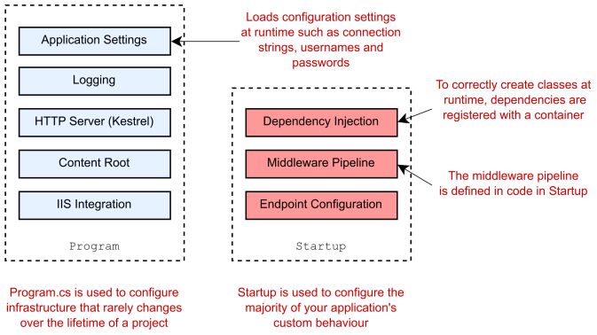
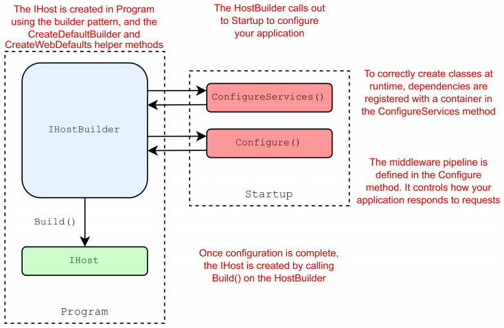

Chapter 11-Configuration
==============================

An ***host*** is an object that encapsulates an app's resources, such as:
<ul>
  <li>Dependency injection (DI)</li>
  <li>Logging</li>
  <li>Configuration</li>
  <li>IHostedService implementations</li>
</ul> 




some source code:
```C#
public class Program {
   public static void Main(string[] args) {
      CreateHostBuilder(args).Build().Run();
   }

   public static IHostBuilder CreateHostBuilder(string[] args) => {
      Host.CreateDefaultBuilder(args).
          .ConfigureWebHostDefaults(webBuilder => {
              webBuilder.UseStartup<Startup>();
          });
   });
}

public static class Host {

   public static IHostBuilder CreateDefaultBuilder() => CreateDefaultBuilder(args: null);

   public static IHostBuilder CreateDefaultBuilder(string[] args) {   // initializes a new instance of HostBuilder class with pre-configured defaults
      var builder = new HostBuilder();

      builder.UseContentRoot(Directory.GetCurrentDirectory());   // specify the content root directory to be used by the host.

      builder.ConfigureHostConfiguration(config => {             // config is IConfigurationBuilder
         config.AddEnvironmentVariables(prefix: "DOTNET_");
         if (args != null) {
            config.AddCommandLine(args);
         }
      });
      // ------------------Configures application settings, the is the main topic of this chapter----------------------------------------------
      builder.ConfigureAppConfiguration((hostingContext, config) => {   // hostingContext is HostBuilderContext, config is IConfigurationBuilder
          IHostEnvironment env = hostingContext.HostingEnvironment;
          bool reloadOnChange = hostingContext.Configuration.GetValue("hostBuilder:reloadConfigOnChange", defaultValue: true);

          config.AddJsonFile("appsettings.json", optional: true, reloadOnChange: reloadOnChange)   // Add JsonConfigurationProvider
                .AddJsonFile($"appsettings.{env.EnvironmentName}.json", optional: true, reloadOnChange: reloadOnChange);

          if (env.IsDevelopment() && !string.IsNullOrEmpty(env.ApplicationName)) {
             var appAssembly = Assembly.Load(new AssemblyName(env.ApplicationName));
             if (appAssembly != null) {
                config.AddUserSecrets(appAssembly, optional: true);   // asp.net core app uses secerets by default
             }
          }

          config.AddEnvironmentVariables();

          if (args != null) {
             config.AddCommandLine(args);
          }
      });
      // ----------------------------------------------------------------------------------------------------------------------------------------
      builder.ConfigureLogging((hostingContext, logging) => {
         logging.AddConfiguration(hostingContext.Configuration.GetSection("Logging"));
         logging.AddConsole();
         logging.AddDebug();
      });

      // Configures the DI container
      builder.UseDefaultServiceProvider((context, options) => {
         var isDevelopment = context.HostingEnvironment.IsDevelopment();
         options.ValidateScopes = isDevelopment;
         options.ValidateOnBuild = isDevelopment;
      });

      return builder;
   }
}
//------------------------------------------------------------------------------------------------------------------------------
public interface IHostBuilder {
   IDictionary<object, object> Properties { get; }

   IHostBuilder ConfigureAppConfiguration(Action<HostBuilderContext, IConfigurationBuilder> configureDelegate);
   IHostBuilder ConfigureContainer<TContainerBuilder>(Action<HostBuilderContext, TContainerBuilder> configureDelegate);
   IHostBuilder ConfigureHostConfiguration(Action<IConfigurationBuilder> configureDelegate);
   IHostBuilder ConfigureServices(Action<HostBuilderContext, IServiceCollection> configureDelegate);
   IHostBuilder UseServiceProviderFactory<TContainerBuilder>(IServiceProviderFactory<TContainerBuilder> factory);
   IHostBuilder UseServiceProviderFactory<TContainerBuilder>(Func<HostBuilderContext, IServiceProviderFactory<TContainerBuilder>> factory);

   IHost Build();
}

public static class HostingHostBuilderExtensions {
   ...
   public static IHostBuilder UseContentRoot(this IHostBuilder hostBuilder, string contentRoot) {
      return hostBuilder.ConfigureHostConfiguration(configBuilder => {
         configBuilder.AddInMemoryCollection(new[] {
            new KeyValuePair<string, string>(HostDefaults.ContentRootKey,
            contentRoot  ?? throw new ArgumentNullException(nameof(contentRoot)))
         });
      });
   }
   
   // specify the IServiceProvider to be the default one
   public static IHostBuilder UseDefaultServiceProvider(this IHostBuilder hostBuilder, Action<HostBuilderContext, ServiceProviderOptions> configure) {
      return hostBuilder.UseServiceProviderFactory(context => {
         var options = new ServiceProviderOptions();
         configure(context, options);
         return new DefaultServiceProviderFactory(options);
      });
   }

   public static IHostBuilder ConfigureLogging(this IHostBuilder hostBuilder, Action<ILoggingBuilder> configureLogging) {
      return hostBuilder.ConfigureServices((context, collection) => collection.AddLogging(builder => configureLogging(builder)));
   }
}

public class HostBuilder : IHostBuilder {
   private List<Action<IConfigurationBuilder>> _configureHostConfigActions = new List<Action<IConfigurationBuilder>>();
   private List<Action<HostBuilderContext, IConfigurationBuilder>> _configureAppConfigActions = new List<Action<HostBuilderContext, IConfigurationBuilder>>();
   private List<Action<HostBuilderContext, IServiceCollection>> _configureServicesActions = new List<Action<HostBuilderContext, IServiceCollection>>();
   private List<IConfigureContainerAdapter> _configureContainerActions = new List<IConfigureContainerAdapter>();
   private IServiceFactoryAdapter _serviceProviderFactory = new ServiceFactoryAdapter<IServiceCollection>(new DefaultServiceProviderFactory());
   private bool _hostBuilt;
   private IConfiguration _hostConfiguration;
   private IConfiguration _appConfiguration;   // will hold all the configuration key values eventually
   private HostBuilderContext _hostBuilderContext;
   private IHostingEnvironment _hostingEnvironment;
   private IServiceProvider _appServices;

   public IDictionary<object, object> Properties { get; } = new Dictionary<object, object>();

   public IHostBuilder ConfigureHostConfiguration(Action<IConfigurationBuilder> configureDelegate) {
      _configureHostConfigActions.Add(configureDelegate ?? throw new ArgumentNullException(nameof(configureDelegate)));
      return this;
   }

   public IHostBuilder ConfigureAppConfiguration(Action<HostBuilderContext, IConfigurationBuilder> configureDelegate) {
      _configureAppConfigActions.Add(configureDelegate ?? throw new ArgumentNullException(nameof(configureDelegate)));
      return this;
   }

   public IHostBuilder ConfigureServices(Action<HostBuilderContext, IServiceCollection> configureDelegate) {
      _configureServicesActions.Add(configureDelegate ?? throw new ArgumentNullException(nameof(configureDelegate)));
      return this;
   }

   // overrides the factory used to create the service provider
   public IHostBuilder UseServiceProviderFactory<TContainerBuilder>(IServiceProviderFactory<TContainerBuilder> factory) {
       _serviceProviderFactory = new ServiceFactoryAdapter<TContainerBuilder>(factory ?? throw new ArgumentNullException(nameof(factory)));
       return this;
   }
   ...
   public IHost Build() {
      if (_hostBuilt) {
         throw new InvalidOperationException("Build can only be called once.");
      }
      _hostBuilt = true;

      BuildHostConfiguration();     // add environment related providers to ConfigurationBuilder
      CreateHostingEnvironment();   // provide HostingEnvironment that tells the app the environment e.g "Development"
      CreateHostBuilderContext();   // provide HostBuilderContext for BuildAppConfiguration as the first paramater to execute the delegate
      BuildAppConfiguration();
      CreateServiceProvider();

      return _appServices.GetRequiredService<IHost>();
   }

   private void BuildHostConfiguration() {
      var configBuilder = new ConfigurationBuilder();
      foreach (var buildAction in _configureHostConfigActions) {
         buildAction(configBuilder);
      }
      _hostConfiguration = configBuilder.Build();
   }

   private void CreateHostingEnvironment() {
      _hostingEnvironment = new HostingEnvironment() {
         ApplicationName = _hostConfiguration[HostDefaults.ApplicationKey],
         EnvironmentName = _hostConfiguration[HostDefaults.EnvironmentKey] ?? EnvironmentName.Production,
         ContentRootPath = ResolveContentRootPath(_hostConfiguration[HostDefaults.ContentRootKey], AppContext.BaseDirectory),
      }
      _hostingEnvironment.ContentRootFileProvider = new PhysicalFileProvider(_hostingEnvironment.ContentRootPath);
   }

   private void CreateHostBuilderContext() {
      _hostBuilderContext = new HostBuilderContext(Properties) {
         HostingEnvironment = _hostingEnvironment,
         Configuration = _hostConfiguration
      }
   }

   private void BuildAppConfiguration() {
      var configBuilder = new ConfigurationBuilder();
      configBuilder.AddConfiguration(_hostConfiguration);
      foreach (var buildAction in _configureAppConfigActions) {
         buildAction(_hostBuilderContext, configBuilder);
      }
      _appConfiguration = configBuilder.Build();
      _hostBuilderContext.Configuration = _appConfiguration;
   }

   private void CreateServiceProvider() {
      var services = new ServiceCollection();
      services.AddSingleton(_hostingEnvironment);
      services.AddSingleton(_hostBuilderContext);
      services.AddSingleton(_appConfiguration);
      services.AddSingleton<IApplicationLifetime, ApplicationLifetime>();
      services.AddSingleton<IHostLifetime, ConsoleLifetime>();
      services.AddSingleton<IHost, Host>();
      services.AddOptions();
      services.AddLogging();

      foreach (var configureServicesAction in _configureServicesActions) {
         configureServicesAction(_hostBuilderContext, services);
      }

      var containerBuilder = _serviceProviderFactory.CreateBuilder(services);   // containerBuilder is ServiceCollection

      foreach (var containerAction in _configureContainerActions) {
         containerAction.ConfigureContainer(_hostBuilderContext, containerBuilder);
      }

      _appServices = _serviceProviderFactory.CreateServiceProvider(containerBuilder);
   }
   ...
}

public class DefaultServiceProviderFactory : IServiceProviderFactory<IServiceCollection> {
   private readonly ServiceProviderOptions _options;

   public DefaultServiceProviderFactory() : this(ServiceProviderOptions.Default) { }
   ...

   public IServiceCollection CreateBuilder(IServiceCollection services) {
      return services;
   }

   public IServiceProvider CreateServiceProvider(IServiceCollection containerBuilder) {
      return containerBuilder.BuildServiceProvider(_options);
   }
}

public class HostBuilderContext {
   public HostBuilderContext(IDictionary<object, object> properties);
   public IConfiguration Configuration { get; set; }
   public IHostEnvironment HostingEnvironment { get; set; }
   public IDictionary<object, object> Properties { get; }
}

//-------------------------------------------------------------------------------------------------

public interface IConfigurationBuilder {
   IDictionary<string, object> Properties { get; }
   IList<IConfigurationSource> Sources { get; }
   IConfigurationBuilder Add(IConfigurationSource source);
   IConfigurationRoot Build();
}

public static class JsonConfigurationExtensions {
   public static IConfigurationBuilder AddJsonFile(this IConfigurationBuilder builder, string path) {
      return AddJsonFile(builder, provider: null, path: path, optional: false, reloadOnChange: false);
   }
   ...
   public static IConfigurationBuilder AddJsonFile(this IConfigurationBuilder builder, IFileProvider provider, string path, bool optional, bool reloadOnChange) {
      return builder.AddJsonFile(s => {   // s is JsonConfigurationSource
         s.FileProvider = provider;
         s.Path = path;
         s.Optional = optional;
         s.ReloadOnChange = reloadOnChange;
         s.ResolveFileProvider();
      });
   }
   public static IConfigurationBuilder AddJsonFile(this IConfigurationBuilder builder, Action<JsonConfigurationSource> configureSource) {
      builder.Add(configureSource);
   }
}

public class ConfigurationBuilder : IConfigurationBuilder {
    public IList<IConfigurationSource> Sources { get; } = new List<IConfigurationSource>();

    public IDictionary<string, object> Properties { get; } = new Dictionary<string, object>();

    public IConfigurationBuilder Add(IConfigurationSource source) {
       if (source == null) {
          throw new ArgumentNullException(nameof(source));
       }
       Sources.Add(source);
       return this;
    }

    public IConfigurationRoot Build() {
       var providers = new List<IConfigurationProvider>();
       foreach (var source in Sources) {
          var provider = source.Build(this);
          providers.Add(provider);
       }
       return new ConfigurationRoot(providers);
    }
}

public interface IConfigurationSource {
   IConfigurationProvider Build(IConfigurationBuilder builder);
}

public interface IConfigurationProvider {
   IEnumerable<string> GetChildKeys(IEnumerable<string> earlierKeys, string parentPath);
   IChangeToken GetReloadToken();
   void Load();
   void Set(string key, string value);
   bool TryGet(string key, out string value);
}

public interface IConfigurationRoot : IConfiguration {
   IEnumerable<IConfigurationProvider> Providers { get; }
   void Reload();
}

public interface IConfiguration {
   string this[string key] { get; set; }
   IConfigurationSection GetSection(string key);
   ...
}

public class ConfigurationRoot : IConfigurationRoot {
   private IList<IConfigurationProvider> _providers;
   private ConfigurationReloadToken _changeToken = new ConfigurationReloadToken();

   public ConfigurationRoot(IList<IConfigurationProvider> providers) {
      _providers = providers;
      foreach (var p in providers) {
         p.Load();
         ChangeToken.OnChange(() => p.GetReloadToken(), () => RaiseChanged());
      }
   }

   public IEnumerable<IConfigurationProvider> Providers => _providers;

   public string this[string key] {
      get {
         foreach (var provider in _providers.Reverse()) {
            string value;
            if (provider.TryGet(key, out value)) {
               return value;
            }
         }
          return null;
      }

      set {
         foreach (var provider in _providers) {
            provider.Set(key, value);
         }
      }
   }

   public IConfigurationSection GetSection(string key) => new ConfigurationSection(this, key);

   public IChangeToken GetReloadToken() => _changeToken;

   public IEnumerable<IConfigurationSection> GetChildren() => GetChildrenImplementation(null);

   internal IEnumerable<IConfigurationSection> GetChildrenImplementation(string path) {
      return _providers.Aggregate(Enumerable.Empty<string>(), seed, source) => source.GetChildKeys(seed, path))
                       .Distinct()
                       .Select(key => GetSection(path == null ? key : ConfigurationPath.Combine(path, key)));
   }

   public void Reload() {
      foreach (var provider in _providers) {
         provider.Load();
      }
   }

   private void RaiseChanged() {
      var previousToken = Interlocked.Exchange(ref _changeToken, new ConfigurationReloadToken());
      previousToken.OnReload();
   }
}

public class ConfigurationSection : IConfigurationSection {
   private readonly ConfigurationRoot _root;
   private readonly string _path;
   private string _key;

   public ConfigurationSection(ConfigurationRoot root, string path) {
      _root = root;
      _path = path;
   }

   public string Path => _path;

   public string Key {
      get {
         if (_key == null) {
            // Key is calculated lazily as last portion of Path
             _key = ConfigurationPath.GetSectionKey(_path);
         }
         return _key;
      }
   }

   public string Value {
      get {
         return _root[Path];
      }
      set {
         _root[Path] = value;
      }
   }

   public string this[string key] {
      get {
         return _root[ConfigurationPath.Combine(Path, key)];
      }
      set {
         _root[ConfigurationPath.Combine(Path, key)] = value;
      }
   }

    public IConfigurationSection GetSection(string key) => _root.GetSection(ConfigurationPath.Combine(Path, key));

    public IEnumerable<IConfigurationSection> GetChildren() => _root.GetChildrenImplementation(Path);

    public IChangeToken GetReloadToken() => _root.GetReloadToken();
}

public static class ConfigurationPath {
   public static readonly string KeyDelimiter = ":";

   public static string Combine(params string[] pathSegments) {
      return string.Join(KeyDelimiter, pathSegments);
   }

   public static string Combine(IEnumerable<string> pathSegments) {
      return string.Join(KeyDelimiter, pathSegments);
   }

   public static string GetSectionKey(string path) {
      if (string.IsNullOrEmpty(path)) {
         return path;
      }
      var lastDelimiterIndex = path.LastIndexOf(KeyDelimiter, StringComparison.OrdinalIgnoreCase);
      return lastDelimiterIndex == -1 ? path : path.Substring(lastDelimiterIndex + 1);
   }

   public static string GetParentPath(string path) {
      if (string.IsNullOrEmpty(path)) {
         return null;
      }
      var lastDelimiterIndex = path.LastIndexOf(KeyDelimiter, StringComparison.OrdinalIgnoreCase);
      return lastDelimiterIndex == -1 ? null : path.Substring(0, lastDelimiterIndex);
   }
}
```
An example to add EnvironmentVariablesProvider:
```C#
public static class EnvironmentVariablesExtensions {
   ...
   public static IConfigurationBuilder AddEnvironmentVariables(this IConfigurationBuilder configurationBuilder) {
      configurationBuilder.Add(new EnvironmentVariablesConfigurationSource());
      return configurationBuilder;
   }

   public static IConfigurationBuilder AddEnvironmentVariables( this IConfigurationBuilder configurationBuilder, string prefix) {
      configurationBuilder.Add(new EnvironmentVariablesConfigurationSource { Prefix = prefix });
      return configurationBuilder;
   }

   public static IConfigurationBuilder AddEnvironmentVariables(this IConfigurationBuilder builder, Action<EnvironmentVariablesConfigurationSource> configureSource) => builder.Add(configureSource);
}

public class EnvironmentVariablesConfigurationSource : IConfigurationSource {
   public string Prefix { get; set; }

   public IConfigurationProvider Build(IConfigurationBuilder builder) {
      return new EnvironmentVariablesConfigurationProvider(Prefix);
   }
}

public class EnvironmentVariablesConfigurationProvider : ConfigurationProvider {
   private const string MySqlServerPrefix = "MYSQLCONNSTR_";
   private const string SqlAzureServerPrefix = "SQLAZURECONNSTR_";
   private const string SqlServerPrefix = "SQLCONNSTR_";
   private const string CustomPrefix = "CUSTOMCONNSTR_";

   private const string ConnStrKeyFormat = "ConnectionStrings:{0}";
   private const string ProviderKeyFormat = "ConnectionStrings:{0}_ProviderName";

   private readonly string _prefix;

   public EnvironmentVariablesConfigurationProvider() : this(string.Empty) { }

   public EnvironmentVariablesConfigurationProvider(string prefix) {
      _prefix = prefix ?? string.Empty;
   }

   public override void Load() {
      Load(Environment.GetEnvironmentVariables());
   }

   internal void Load(IDictionary envVariables) {
      Data = new Dictionary<string, string>(StringComparer.OrdinalIgnoreCase);
      
      var filteredEnvVariables = envVariables.Cast<DictionaryEntry>().SelectMany(AzureEnvToAppEnv).Where(entry => ((string)entry.Key).StartsWith(_prefix, StringComparison.OrdinalIgnoreCase));

      foreach (var envVariable in filteredEnvVariables) {
         var key = ((string)envVariable.Key).Substring(_prefix.Length);
         Data[key] = (string)envVariable.Value;
      }
   }

   private static string NormalizeKey(string key) {
      return key.Replace("__", ConfigurationPath.KeyDelimiter);   // KeyDelimiter is ":"
   }

   private static IEnumerable<DictionaryEntry> AzureEnvToAppEnv(DictionaryEntry entry) {
      var key = (string)entry.Key;
      var prefix = string.Empty;
      var provider = string.Empty;

      if (key.StartsWith(MySqlServerPrefix, StringComparison.OrdinalIgnoreCase)) {
         prefix = MySqlServerPrefix;
         provider = "MySql.Data.MySqlClient";
      } else if (key.StartsWith(SqlAzureServerPrefix, StringComparison.OrdinalIgnoreCase)) {
         prefix = SqlAzureServerPrefix;
         provider = "System.Data.SqlClient";
      } else if (key.StartsWith(SqlServerPrefix, StringComparison.OrdinalIgnoreCase)) {
         prefix = SqlServerPrefix;
         provider = "System.Data.SqlClient";
      } else if (key.StartsWith(CustomPrefix, StringComparison.OrdinalIgnoreCase)) {
         prefix = CustomPrefix;
      } else {
         entry.Key = NormalizeKey(key);
          yield return entry;
          yield break;
      }

      yield return new DictionaryEntry(string.Format(ConnStrKeyFormat, NormalizeKey(key.Substring(prefix.Length))), entry.Value);

      if (!string.IsNullOrEmpty(provider)) {
         yield return new DictionaryEntry(string.Format(ProviderKeyFormat, NormalizeKey(key.Substring(prefix.Length))), provider);
      }
   }
}

public abstract class ConfigurationProvider : IConfigurationProvider {
   private ConfigurationReloadToken _reloadToken = new ConfigurationReloadToken();
   protected IDictionary<string, string> Data { get; set; }

   protected ConfigurationProvider() {
      Data = new Dictionary<string, string>(StringComparer.OrdinalIgnoreCase);
   }

   public virtual bool TryGet(string key, out string value) => Data.TryGetValue(key, out value);

   public virtual void Set(string key, string value) => Data[key] = value;

   public virtual void Load() { }

   public virtual IEnumerable<string> GetChildKeys(IEnumerable<string> earlierKeys, string parentPath) {
      var prefix = parentPath == null ? string.Empty : parentPath + ConfigurationPath.KeyDelimiter;

      return Data.Where(kv => kv.Key.StartsWith(prefix, StringComparison.OrdinalIgnoreCase))
                 .Select(kv => Segment(kv.Key, prefix.Length))
                 .Concat(earlierKeys)
                 .OrderBy(k => k, ConfigurationKeyComparer.Instance);
   }

   private static string Segment(string key, int prefixLength) {
      var indexOf = key.IndexOf(ConfigurationPath.KeyDelimiter, prefixLength, StringComparison.OrdinalIgnoreCase);
      return indexOf < 0 ? key.Substring(prefixLength) : key.Substring(prefixLength, indexOf - prefixLength);
   }

   public IChangeToken GetReloadToken() {
      return _reloadToken;
   }

   protected void OnReload() {
      var previousToken = Interlocked.Exchange(ref _reloadToken, new ConfigurationReloadToken());
      previousToken.OnReload();
   }
}
```

-To work in the future, fully understand the above code

Now you might see that when you register your own service in Startup.cs, Startup.cs's ConfigureServices method must somehow "connect" to the HostBuilder in Program.CS

So how does Startup.cs's ConfigureServices method influence `HostBuilder`s `_configureServicesActions` so that the services you register in Startup.cs can be actually add to the Host in Program.cs? It is the `ConfigureWebHostDefaults` method acts as the bridge.


If you want to add your own provider, you can do :
```C#
public class Program
{
   public static void Main(string[] args) {
      CreateHostBuilder(args).Build().Run();
   }

   public static IHostBuilder CreateHostBuilder(string[] args) =>
       Host.CreateDefaultBuilder(args)
           .ConfigureAppConfiguration((hostingContext, config) => {
              if (hostingContext.HostingEnvironment.IsDevelopment()) {
                 config.AddXXX();
              }
           })
           .ConfigureWebHostDefaults(webBuilder => {
              webBuilder.UseStartup<Startup>();
           });   
}
```

<!-- <code>&lt;T&gt;<code> -->

<!-- <div class="alert alert-info p-1" role="alert">
    
</div> -->

<!-- <div class="alert alert-info pt-2 pb-0" role="alert">
    <ul class="pl-1">
      <li></li>
      <li></li>
    </ul>  
</div> -->

<!-- <ul>
  <li></li>
  <li></li>
  <li></li>
  <li></li>
</ul>  -->

<!-- <ul>
  <li><b></b></li>
  <li><b></b></li>
  <li><b></b></li>
  <li><b></b></li>
</ul>  -->

<!--  -->

<!-- <span style="color:red">hurt</span> -->

<style type="text/css">
.markdown-body {
  max-width: 1800px;
  margin-left: auto;
  margin-right: auto;
}
</style>

<link rel="stylesheet" href="./zCSS/bootstrap.min.css">
<script src="./zCSS/jquery-3.3.1.slim.min.js"></script>
<script src="./zCSS/popper.min.js"></script>
<script src="./zCSS/bootstrap.min.js"></script>