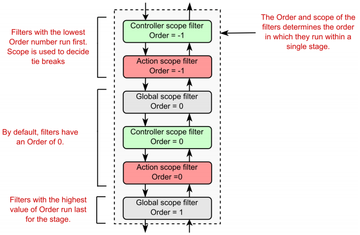

Chapter 13-Filters
==============================


```C#
public interface IAuthorizationFilter : IFilterMetadata {
   void OnAuthorization(AuthorizationFilterContext context);
}

public class AuthorizationFilterContext : FilterContext {
   public AuthorizationFilterContext(ActionContext actionContext, IList<IFilterMetadata> filters);

   public virtual IActionResult Result { get; set; }
}

//--------------------------------------------------------------------------------------------------
public interface IResourceFilter : IFilterMetadata {
   void OnResourceExecuted(ResourceExecutedContext context);
   void OnResourceExecuting(ResourceExecutingContext context);
}

public class ResourceExecutedContext : FilterContext {
   public ResourceExecutedContext(ActionContext actionContext, IList<IFilterMetadata> filters);

   public virtual bool Canceled { get; set; }   // no Canceled counterpart in ResourceExecutingContext
   public virtual Exception Exception { get; set; }
   public virtual ExceptionDispatchInfo ExceptionDispatchInfo { get; set; }
   public virtual bool ExceptionHandled { get; set; }
   public virtual IActionResult Result { get; set; }
}

public class ResourceExecutingContext : FilterContext {
   public ResourceExecutingContext(ActionContext actionContext, IList<IFilterMetadata> filters, IList<IValueProviderFactory> valueProviderFactories);

   public virtual IActionResult Result { get; set; }
   public IList<IValueProviderFactory> ValueProviderFactories { get; }
                                              // no Canceled getter and setter as its counterpart, because you need to short circuit by setting Result
}

//---------------------------------------------------------------------------------------------------
public interface IActionFilter : IFilterMetadata {
   void OnActionExecuted(ActionExecutedContext context);
   void OnActionExecuting(ActionExecutingContext context);
}

public class ActionExecutedContext : FilterContext {
   public ActionExecutedContext(ActionContext actionContext, IList<IFilterMetadata> filters, object controller);

   public virtual bool Canceled { get; set; }    // no Canceled counterpart in ActionExecutingContext
   public virtual object Controller { get; }
   public virtual Exception Exception { get; set; }
   public virtual ExceptionDispatchInfo ExceptionDispatchInfo { get; set; }
   public virtual bool ExceptionHandled { get; set; }
   public virtual IActionResult Result { get; set; }
}

public class ActionExecutingContext : FilterContext {
   public ActionExecutingContext(ActionContext actionContext, IList<IFilterMetadata> filters, IDictionary<string, object> actionArguments, object controller);

   public virtual IDictionary<string, object> ActionArguments { get; }
   public virtual object Controller { get; }
   public virtual IActionResult Result { get; set; }
                                                     // no Canceled getter and setter as its counterpart, because you need to short circuit by setting Result
}

//---------------------------------------------------------------------------------------------------
public interface IResultFilter : IFilterMetadata {
   void OnResultExecuted(ResultExecutedContext context);
   void OnResultExecuting(ResultExecutingContext context);
}

public class ResultExecutedContext : FilterContext {
   public ResultExecutedContext(ActionContext actionContext, IList<IFilterMetadata> filters, IActionResult result, object controller);

   public virtual bool Canceled { get; set; }  // its counter part is called "Cancel"
   public virtual object Controller { get; }
   public virtual Exception Exception { get; set; }
   public virtual ExceptionDispatchInfo ExceptionDispatchInfo { get; set; }
   public virtual bool ExceptionHandled { get; set; }
   public virtual IActionResult Result { get; }
}

public class ResultExecutingContext : FilterContext {
   public ResultExecutingContext(ActionContext actionContext, IList<IFilterMetadata> filters, IActionResult result, object controller);

   public virtual bool Cancel { get; set; }   // its counter part is called "Canceled"
   public virtual object Controller { get; }
   public virtual IActionResult Result { get; set; }
}

//---------------------------------------------------------------------------------------------------
public interface IExceptionFilter : IFilterMetadata {
   void OnException(ExceptionContext context);
}

public class ExceptionContext : FilterContext {
   public ExceptionContext(ActionContext actionContext, IList<IFilterMetadata> filters);

   public virtual Exception Exception { get; set; }
   public virtual ExceptionDispatchInfo ExceptionDispatchInfo { get; set; }
   public virtual bool ExceptionHandled { get; set; }
   public virtual IActionResult Result { get; set; }
}
```
## Async Filters

Async version of a filter follows this pattern: `public interface IAsyncXXXFilter : IFilterMetadata { Task OnXXXExecutionAsync(XXXExecutingContext context, XXXExecutionDelegate next)}`, for example, an async resource filter:
```C#
public interface IAsyncResourceFilter : IFilterMetadata {
   Task OnResourceExecutionAsync(ResourceExecutingContext context, ResourceExecutionDelegate next);  // no need of ResourceExecutedContext
}

public delegate Task<ResourceExecutedContext> ResourceExecutionDelegate();
```
Note that we don't need `XXXExecutingContext` such as `ResourceExecutedContext` because the delegate will return one, for example:
```C#
public class LogAsyncResourceFilter : Attribute, IAsyncResourceFilter
{
   public async Task OnResourceExecutionAsync(ResourceExecutingContext context, ResourceExecutionDelegate next) {
      Console.WriteLine("Executing async!");
      ResourceExecutedContext executedContext = await next();   
      Console.WriteLine("Executed async!");   // code below await next() is like in OnResourceExecuting(ResourceExecutingContext context)
   }
}
```

some helper build-in attributes:
```C#
[AttributeUsage(AttributeTargets.Class | AttributeTargets.Method, AllowMultiple = true, Inherited = true)]
public abstract class ActionFilterAttribute : Attribute, IActionFilter, IAsyncActionFilter, IResultFilter, IAsyncResultFilter, IOrderedFilter {
   
   public int Order { get; set; }

   public virtual void OnActionExecuting(ActionExecutingContext context) {

   }

   public virtual void OnActionExecuted(ActionExecutedContext context) {

   }

   public virtual async Task OnActionExecutionAsync(ActionExecutingContext context, ActionExecutionDelegate next) {
      OnActionExecuting(context);
      if (context.Result == null) {
         OnActionExecuted(await next());
      }
   }

   public virtual void OnResultExecuting(ResultExecutingContext context) {

   }

   public virtual void OnResultExecuted(ResultExecutedContext context) {

   }

   public virtual async Task OnResultExecutionAsync(ResultExecutingContext context, ResultExecutionDelegate next) {
      OnResultExecuting(context);
      if (!context.Cancel) {
         OnResultExecuted(await next());
      }
   }
}
```
it gives you convenience as you can implement/override a single method only, e.g:
```C#
// You don't need to implement OnActionExecuted
public class ValidateModelAttribute : ActionFilterAttribute
{
   public override void OnActionExecuting(ActionExecutingContext context) {
      if (!context.ModelState.IsValid) {
         context.Result = new BadRequestObjectResult(context.ModelState);
      }
   }
}
//-----------------------------------------------------------------------------------------------
[AttributeUsage(AttributeTargets.Class | AttributeTargets.Method, AllowMultiple = true, Inherited = true)]
public abstract class ExceptionFilterAttribute : Attribute, IAsyncExceptionFilter, IExceptionFilter, IOrderedFilter {
   public int Order { get; set; }

   public virtual Task OnExceptionAsync(ExceptionContext context) {
      OnException(context);
      return Task.CompletedTask;
   }

   public virtual void OnException(ExceptionContext context) {

   }
}

// more helper filter attribute such as ResultFilterAttribute etc
```
I don't know why it is called "ActionFilterAttribute" when it contains both action filter and result filter, feel like it is more technically correct to name it "ActionResultFilterAttribute", probably it's because result filters are closely related to action filters, anyway...

## More Source Code:
```C#
public abstract class FilterContext : ActionContext {
   public FilterContext(ActionContext actionContext, IList<IFilterMetadata> filters);
   
   public virtual IList<IFilterMetadata> Filters { get; }
   public TMetadata FindEffectivePolicy<TMetadata>() where TMetadata : IFilterMetadata;
   public bool IsEffectivePolicy<TMetadata>(TMetadata policy) where TMetadata : IFilterMetadata;
}
public class ActionContext {
   public ActionContext() {
      ModelState = new ModelStateDictionary();
   }

   public ActionContext(ActionContext actionContext) : this(actionContext.HttpContext, actionContext.RouteData, actionContext.ActionDescriptor, actionContext.ModelState) {}

   public ActionContext(HttpContext httpContext, RouteData routeData, ActionDescriptor actionDescriptor, ModelStateDictionary modelState) {
      HttpContext = httpContext;
      RouteData = routeData;
      ActionDescriptor = actionDescriptor;
      ModelState = modelState;
   } 

    public HttpContext HttpContext { get; set; } = default!;
    public ModelStateDictionary ModelState { get; } = default!;
    public RouteData RouteData { get; set; } = default!;
    public ActionDescriptor ActionDescriptor { get; set; } = default!;
}
```
Note that most of built-in filter are attributes, e.g;
```C#
public class ConsumesAttribute : Attribute, IResourceFilter ... {
   ...
}
```
while some built-in filters such as `AuthorizeFilter` are not an attribute:
```C#
namespace Microsoft.AspNetCore.Mvc.Authorization {
   public class AuthorizeFilter : IAsyncAuthorizationFilter, IFilterFactory {
      ...
   }
}
```
so you cannot use it directly on top of your action method or controller as an attribute. But you can still use `[Authorize]` to decorate them because "Authorize" in `[Authorize]` is not the filter class itself, it is another attribute class as below shows:
```C#
namespace Microsoft.AspNetCore.Authorization {
   public class AuthorizeAttribute : Attribute, IAuthorizeData {
      ...
   }
}
```
MVC recognizes the `AuthorizeAttribute` and adds an `AuthorizeFilter` instance of this filter to the associated action or controller. The reason to split the filter into two-create a filter class that contains the functionality and an attribute that tells the framework when and where to use the filter is, to inject service into filters, which will be covered in the last section of this chapter.

Let's look at a concrete example `ResponseCacheAttribute` and `ResponseCacheFilter`:
```C#
[AttributeUsage(AttributeTargets.Class | AttributeTargets.Method, AllowMultiple = false, Inherited = true)]
public class ResponseCacheAttribute : Attribute, IFilterFactory, IOrderedFilter {   // note that IOrderedFilter is implemented in the attribute class
   // A nullable-int cannot be used as an Attribute parameter.
   // Hence this nullable-int is present to back the Duration property.
   // The same goes for nullable-ResponseCacheLocation and nullable-bool.
   private int? _duration;
   private ResponseCacheLocation? _location;
   private bool? _noStore;

   public int Duration {
      get => _duration ?? 0;
      set => _duration = value;
   }

   // Gets or sets the location where the data from a particular URL must be cached.
   public ResponseCacheLocation Location {        //public enum ResponseCacheLocation { }
      get => _location ?? ResponseCacheLocation.Any;
      set => _location = value;
   }

   // When set to true, it sets "Cache-control" header to "no-store".
   public bool NoStore {
      get => _noStore ?? false;
      set => _noStore = value;
   }
   
   // Gets or sets the value for the Vary response header
   public string VaryByHeader { get; set; }

   // Gets or sets the query keys to vary by
   public string[] VaryByQueryKeys { get; set; }

   // Gets or sets the value of the cache profile name
   public string CacheProfileName { get; set; }

   public int Order { get; set; }

   public bool IsReusable => true;

   public CacheProfile GetCacheProfile(MvcOptions options) {
      ...
   }

   public IFilterMetadata CreateInstance(IServiceProvider serviceProvider) {
      ...
      return new ResponseCacheFilter(cacheProfile, loggerFactory);
   }
}

internal class ResponseCacheFilter : IActionFilter, IResponseCacheFilter {
   private readonly ResponseCacheFilterExecutor _executor;
   private readonly ILogger _logger;

   public ResponseCacheFilter(CacheProfile cacheProfile, ILoggerFactory loggerFactory) {
      _executor = new ResponseCacheFilterExecutor(cacheProfile);
      _logger = loggerFactory.CreateLogger(GetType());
   }

   public int Duration {
      get => _executor.Duration;
      set => _executor.Duration = value;
   } 

   ...

   public void OnActionExecuting(ActionExecutingContext context) {
      var effectivePolicy = context.FindEffectivePolicy<IResponseCacheFilter>();
      if (effectivePolicy != null && effectivePolicy != this) {
         _logger.NotMostEffectiveFilter(GetType(), effectivePolicy.GetType(), typeof(IResponseCacheFilter));
          return;
      }
      _executor.Execute(context);
   }

   public void OnActionExecuted(ActionExecutedContext context) {
      
   }
}
```

## Understanding the order of filter execution


You can implement `IOrderFilter` interface to override the default order of filter execution.
```C#
public interface IOrderedFilter {
   int Order { get; }
}
```
The filters for Order = -1 execute first, as they have the lowest Order value. By default, if a filter doesn't implement IOrderedFilter, it's assumed to have Order = 0. All the filters that ship as part of ASP.NET Core have Order = 0.



## Short-Curcuit a Pipeline


For Action Filters, when you short circuit (there are two ways to short circuit) the pipeline, it doesn't mean the request will directly sent to users ((executed by the view engine, of course), as I used to think when an action filter short circuit, the remaining filter of other categories (e.g resource filter) won't run, which is incorrect. Short circuit an actin filter bypass the action filters "below" (supposed to) it. Let's say you have three action filter `FirstAction`, `SecondAction` and `ThirdAction` apply on an action method:

```C#
[FirstAction]
[SecondAction]
[ThirdAction]
public IActionResult Index() {
   ...
}
```

#### First Method to Short Circuit Action Filter
```C#
public class SecondAction : Attribute, IActionFilter {
   public void OnActionExecuted(ActionExecutedContext context) {
      
   }

   public void OnActionExecuting(ActionExecutingContext context) {
      context.Result = new BadRequestObjectResult(context.ModelState);
   }
}
```
`ThirdAction` is bypassed, none of its `OnActionExecuted` or `OnActionExecuting` method will run, also note that `SecondAction`'s `OnActionExecuted` is also short-circuited, but `FirstAction`'s OnActionExecuted will run:
```C#
public class FirstAction : Attribute, IActionFilter {
   public void OnActionExecuted(ActionExecutedContext context) {
      // this method will run and
      // context.Canceled (like a getter) is set to true because context.Result has been set in the SecondAction
   }

   public void OnActionExecuting(ActionExecutingContext context) {
      
   }
}
```
You might wonder what if you "short circuit" in SecondAction's OnActionExecuted as:
```C#
public class SecondAction : Attribute, IActionFilter {
   public void OnActionExecuted(ActionExecutedContext context) {
      context.Result = new BadRequestObjectResult(context.ModelState);
   }

   public void OnActionExecuting(ActionExecutingContext context) {
      // context.Result = new BadRequestObjectResult(context.ModelState);   // commented out 
   }
}
```
You will find:
```C#
public class FirstAction : Attribute, IActionFilter {
   public void OnActionExecuted(ActionExecutedContext context) {
      // this method will run (of course)
      // but context.Canceled is false, NOT set to true
   }

   public void OnActionExecuting(ActionExecutingContext context) {   

   }
}
```
You see that setting `context.Result` in OnActionExecuted does nothing, which actually makes sense, because at this stage, `context.Result` has already set by the action method, the framework wouldn't know (well, the framework can surely distinguish them, but it is not necessary) the new BadRequestObjectResult is set by the action method or replaced by the action filter's OnActionExecuted method.

So setting `context.Result` in OnActionExecuted method does't really short circuit, how can we short circuit in OnActionExecuted method? We have to set `context.Canceled` to true as the next sub section explains.

You can only set `context.Result` in OnActionExecuting method to short-circuit, now you see why `ActionExecutingContext` doesn't have a `Canceled` getter/setter which its couterpart `ActionExecutedContext` does have

#### Second Method to "Short-Circuit" Action Filter in OnActionExecuted
This time you do:
```C#
public class SecondAction : Attribute, IActionFilter {
   public void OnActionExecuted(ActionExecutedContext context) {
      context.Canceled = true;
   }

   public void OnActionExecuting(ActionExecutingContext context) { 

   }
}
```
You will find:
```C#
public class FirstAction : Attribute, IActionFilter {
   public void OnActionExecuted(ActionExecutedContext context) {
      // this method will run (of course)
      // context.Canceled is set to true because of the setup in SecondAction
   }

   public void OnActionExecuting(ActionExecutingContext context) {

   }
}
```
Both methods will set the actions "above" it, those above actions' `ActionExecutedContext.Canceled` will be set to `true`. But the second method doesn't actually stop FirstAction's OnActionExecuted being running (that's why I put quote on "Short-Circuit"), you have to add some code to achieve a short-circuit alike feature as:
```C#
public class A : Attribute, IActionFilter {
   public void OnActionExecuted(ActionExecutedContext context) {
      if (context.Canceled == true) {
         // Action execution was short-circuited by another filter let's call it B
         // short-circuit can happen in B's OnActionExecuting (B's order < A's order ) or B's OnActionExecuted (B's order > A's order)
         ...
      }
   }

   public void OnActionExecuting(ActionExecutingContext context) {

   }
}
``` 
In a nutshell, to short-circuit an action filter, you set the `context.Result = ...` in `OnActionExecuting` method or `context.Canceled = true` in `OnActionExecuted` method. Both methods will set the actions "above" it, those above actions' `ActionExecutedContext.Canceled` will be set to `true`.

It's important to note that **short circuiting in an action filters only short circuit in all remaining action filters, it doesn't short-circuit result filters, result filters run as normal, as though the action handler itself generated the response.**. Note that if some other filter e.g a resouce filter short-circuit the pipeline,  result filters/other filters won't run, but IActionResult will still be executed to generate the response. Now you see why `ActionFilterAttribute` implements both `IActionFilter`, `IResultFilter` because of this special rule that action filters and result filters always run as a pair, you get the idea!

The most interesting point here is that short-circuiting an action filter (or a page filter) doesn't short-circuit much of the pipeline at all. In fact, it only bypasses later action filters and the action method execution itself.

So now FirstAction's ActionExecutedContext's Canceled is true now, and short-circuit an action filter doesn't short-circuit result filters, so will ActionExecutedContext's Canceled bubble up to the counterpart in result filters? The answer is no, let's illustrate it via code:
```C#
// setup starts --------------------------------------------------------------------------
[FirstAction]
[SecondAction]
[ThirdAction]
[FirstResult]  
public IActionResult Index() {
   ...
}

// note that the existence of A or B both OK
public class SecondAction : Attribute, IActionFilter {
   public void OnActionExecuted(ActionExecutedContext context) {
      context.Canceled = true;   // A
   }

   public void OnActionExecuting(ActionExecutingContext context) { 
      context.Canceled = true;  // B
   }
}
// setup ends, result below ---------------------------------------------------------------
public class FirstAction : Attribute, IActionFilter {
   public void OnActionExecuted(ActionExecutedContext context) {
      // context.Canceled is set to true, which is bubble up from SecondAction

   public void OnActionExecuting(ActionExecutingContext context) {

   }
}

public class FirstResultAttribute : Attribute, IResultFilter
{
   public void OnResultExecuted(ResultExecutedContext context) {
      // ResultExecutedContext has  : public virtual bool Canceled { get; set; }
      // context.Canceled is false here, short circuit from action filter doesn't bubble up
   }

   public void OnResultExecuting(ResultExecutingContext context) {
      // ResultExecutingContext has : public virtual bool Cancel { get; set; }
   }
}
// result ends----------------------------------------------------------------------------
```
So it is important to acknowledge that when you short-circuit action filters either by setting `context.Result = ...` in `OnActionExecuting` or setting `context.Canceled = true` in `OnActionExecuted`, `context.Canceled` only bubble up in action filters. it won't affect other filters such as result filters which will still run normally.

Unlike `ActionExecutedContext` (has `Canceled` getter/setter)and its counterpart `ActionExecutingContext` (without `Canceled` getter/setter), both `ResultExecutedContext` and `ResultExecutingContext` has a getter/setter calling `Canceled` and `Cancel` respectively. So you can short-circuit a result filter in both `OnResultExecuted` and `OnResultExecuting` methods:

```C#
// short-circuit SecondResult filter
// setup starts --------------------------------------------------------------------------
[FirstResult]
[SecondResult]
[ThirdResult]
public IActionResult Index() {
   ...
}

public class SecondResultAttribute : Attribute, IResultFilter
{
   public void OnResultExecuted(ResultExecutedContext context) {
   }

   public void OnResultExecuting(ResultExecutingContext context) {
      context.Cancel = true;
   }
}
// setup ends, result below ---------------------------------------------------------------
public class FirstResultAttribute : Attribute, IResultFilter
{
   public void OnResultExecuted(ResultExecutedContext context) {
      // context.Canceled is true;
   }

   public void OnResultExecuting(ResultExecutingContext context) {
   }
}
// result ends----------------------------------------------------------------------------
```
or
```C#
// setup starts --------------------------------------------------------------------------
public class SecondResultAttribute : Attribute, IResultFilter
{
   public void OnResultExecuted(ResultExecutedContext context) {
      context.Cancel = true;
   }

   public void OnResultExecuting(ResultExecutingContext context) {
      
   }
}
// setup ends, result below ---------------------------------------------------------------
public class FirstResultAttribute : Attribute, IResultFilter
{
   public void OnResultExecuted(ResultExecutedContext context) {
      // context.Canceled is true;
   }

   public void OnResultExecuting(ResultExecutingContext context) {
   }
}
// result ends----------------------------------------------------------------------------
```
The only difference is the execution flow of `ThirdResult`, pretty much the same as action filter.


## Handling Exceptions in Filters

When an exception is thrown in a filter, it is like short-circuit the pipeline. Exception thrown in action filters results in exception filters to run, but exception filters won't run when exceptions thrown in result filters or resource filters.

```C#
// setup starts --------------------------------------------------------------------------
[FirstAction]
[SecondAction]
[ThirdAction]
[FirstResult]
[FirstResource]
public IActionResult Index() {
   ...
}

public class SecondAction : Attribute, IActionFilter {
   public void OnActionExecuted(ActionExecutedContext context) {   // this method won't run after the exception is thrown
   }

   public void OnActionExecuting(ActionExecutingContext context) { 
      /*   Section C to demostrate the null result bubble up even it has been set before the exception thrown
      context.Result = new BadRequestObjectResult(context.ModelState); 
      */ 
      throw new Exception();
   }
}
// setup ends, result below ---------------------------------------------------------------
// firstly, ThirdAction is bypassed and the action hander Index() won't execute
public class FirstAction : Attribute, IActionFilter {
   public void OnActionExecuted(ActionExecutedContext context) {
      // context.ExceptionHandled is false
      // context.Exception is set
      // context.Result is null even when Section C is uncommented
   }

   public void OnActionExecuting(ActionExecutingContext context) {

   }
}

// result filter is not executed as an exception occurs
public class FirstResultAttribute : Attribute, IResultFilter
{
   public void OnResultExecuted(ResultExecutedContext context) {
      // doesn't run
   }

   public void OnResultExecuting(ResultExecutingContext context) {
      // doesn't run
   }
}

// resource filter will run
public class FirstResourceAttribute : Attribute, IResourceFilter
{
   public void OnResourceExecuting(ResourceExecutingContext context) {
      // run
   }

   public void OnResourceExecuted(ResourceExecutedContext context) {
      // run normally with 
      // context.ExceptionHandled is false
      // context.Exception is set
      // context.Result is null even when Section C is uncommented

   }
}
// result ends----------------------------------------------------------------------------
```
**Result filters are only executed when an action method or action filter produces an action result**. They won't run if another filter (other than action filters) short-circuits the pipeline or if there is an exception thrown in action filters(result filters will still run if any action filters "catch" the exception, which will be illustrated via code later in this section). Filters that need to inspect or alter the response, even when the pipeline is short-circuited, can implement the `IAlwaysRunResultFilter` or `IAsyncAlwaysRunResultFilter` interface.

Let's say you have a new setup:
```C#
// setup starts --------------------------------------------------------------------------
[FirstAction]
[SecondAction]
[ThirdAction]
[FirstResult]
[FirstResource]
[HandleException]
public IActionResult Index() {
   ...
}

public class SecondAction : Attribute, IActionFilter {
   public void OnActionExecuted(ActionExecutedContext context) { 
   }

   public void OnActionExecuting(ActionExecutingContext context) { 
      throw new Exception();
   }
}

public class HandleExceptionAttribute : ExceptionFilterAttribute
{
   public override void OnException(ExceptionContext context) {
      var error = new ProblemDetails {
         Title = "An error occured",
         Detail = context.Exception.Message,
         Status = 500,
         Type = "https://httpstatuses.com/500"
      };

      context.Result = new ObjectResult(error) {
        StatusCode = 500   // internal server error
      };

      // setting context.Result implicitly execute the following code to bubble ExceptionHandled up 
      // context.ExceptionHandled = true;
   }
}
// setup ends, result below ---------------------------------------------------------------
// result filter is not executed as an exception occurs and control goes to HandleException exception filter
public class FirstResultAttribute : Attribute, IResultFilter
{
   public void OnResultExecuted(ResultExecutedContext context) {
      // doesn't run
   }

   public void OnResultExecuting(ResultExecutingContext context) {
      // doesn't run
   }
}

// resource filter will run
public class FirstResourceAttribute : Attribute, IResourceFilter
{
   public void OnResourceExecuting(ResourceExecutingContext context) {
      // run as usual
   }

   public void OnResourceExecuted(ResourceExecutedContext context) {
      // run normally with 
      // context.ExceptionHandled is false
      // context.Exception is null
      // context.Result is the ObjectResult set in the exception filter

   }
}
// result ends----------------------------------------------------------------------------
```
Let's look at an insteresting thing, say we modify the HandleException as:
```C#
public class HandleExceptionAttribute : ExceptionFilterAttribute
{
   public override void OnException(ExceptionContext context) {
      var error = new ProblemDetails {
         Title = "An error occured",
         Detail = context.Exception.Message,
         Status = 500,
         Type = "https://httpstatuses.com/500"
      };
      
      /* comment out 
      context.Result = new ObjectResult(error) {
         StatusCode = 500   // internal server error
       };
      */

      context.ExceptionHandled = true;
   }
}
```
Since you didn't set the context.Result, the framework automatically set a `EmptyResult` instance to context.Result. 
```C#
public class FirstResourceAttribute : Attribute, IResourceFilter
{
   public void OnResourceExecuting(ResourceExecutingContext context) {
      
   }

   public void OnResourceExecuted(ResourceExecutedContext context) {
      // context.Result is EmptyResult 
   }
}
```
Now let's look what will happen when one of action filter "catch" the exception (set `context.ExceptionHandled` to true):
```C#
// setup starts --------------------------------------------------------------------------
public class FirstAction : Attribute, IActionFilter {
   public void OnActionExecuted(ActionExecutedContext context) {
      context.ExceptionHandled = true;
   }

   public void OnActionExecuting(ActionExecutingContext context) {

   }
}
// setup ends, result below ---------------------------------------------------------------
// result filter will run because the exception is caught
public class FirstResultAttribute : Attribute, IResultFilter
{
   public void OnResultExecuted(ResultExecutedContext context) {
      // run 
      // context.Result is EmptyResult now, must be set during IActionResult Execution
   }

   public void OnResultExecuting(ResultExecutingContext context) {
      // run 
      // context.Result is still null at this moment
   }
}
// resource filter also runs, of course
// result ends----------------------------------------------------------------------------
```
So we can see that if any action filter "catch" the exception, it is like the exception never happens, the exception filters won't run, and result filters will run.

## Some Common Build-in Filters:
`AddHeader`(Result Filter)
```C#
public class AddHeaderAttribute : ResultFilterAttribute
{
    private readonly string _name;
    private readonly string _value;

    public AddHeaderAttribute(string name, string value)
    {
        _name = name;
        _value = value;
    }

    public override void OnResultExecuting(ResultExecutingContext context)
    {
        context.HttpContext.Response.Headers.Add( _name, new string[] { _value });
        base.OnResultExecuting(context);
    }
}

[AddHeader("Author", "Rick Anderson")]
public class SampleController : Controller {
   ...
}
```

`ResponseCache`(action filter)
```C#
[ResponseCache(Duration = 10, Location = ResponseCacheLocation.Any, NoStore = false)]
public class SampleController : Controller {
   ...
}
```

-[Produces("application/json")]  result filter


`Consumes`(resource filter)] 
```C#

[HttpPost]
[Consumes("application/json")]
public string SaveProductJson(ProductBindingTarget product) {
   return $"JSON: {product.Name}";
}

[HttpPost]
[Consumes("application/xml")]
public string SaveProductXml(ProductBindingTarget product) {
   return $"XML: {product.Name}";
}
```

- OutputCache

## Applying Filters Globally

```C#
public class Startup {
   public void ConfigureServices(IServiceCollection services) {
      services.AddControllers(options => {
         options.Filters.Add(new LogResourceFilter());    // You can pass an instance of the filter directly
         options.Filters.Add(typeof(LogResourceFilter));  // or pass in the Type of the filter and let the framework create it
         options.Filters.Add<LogResourceFilter>();        // Alternatively, the framework can create a global filter using a generic type parameter.
      });
   }
}
```

## Using Dependency Injection with Filter Attributes

This was a fundamental issue with implementing them as attributes that you decorate your actions with. C# attributes don’t let
you pass dependencies into their constructors (other than constant values)

The key is to split the filter into two. Instead of creating a class that’s both an attribute and a filter, create a filter class that contains the functionality and an attribute that tells the framework when and where to use the filter.

-To Work in the future, lear DI book and come back


<!-- <code>&lt;T&gt;<code> -->

<!-- <div class="alert alert-info p-1" role="alert">
    
</div> -->

<!-- <div class="alert alert-info pt-2 pb-0" role="alert">
    <ul class="pl-1">
      <li></li>
      <li></li>
    </ul>  
</div> -->

<!-- <ul>
  <li></li>
  <li></li>
  <li></li>
  <li></li>
</ul>  -->

<!-- <ul>
  <li><b></b></li>
  <li><b></b></li>
  <li><b></b></li>
  <li><b></b></li>
</ul>  -->

<!--  -->

<!-- <span style="color:red">hurt</span> -->

<style type="text/css">
.markdown-body {
  max-width: 1800px;
  margin-left: auto;
  margin-right: auto;
}
</style>

<link rel="stylesheet" href="./zCSS/bootstrap.min.css">
<script src="./zCSS/jquery-3.3.1.slim.min.js"></script>
<script src="./zCSS/popper.min.js"></script>
<script src="./zCSS/bootstrap.min.js"></script>